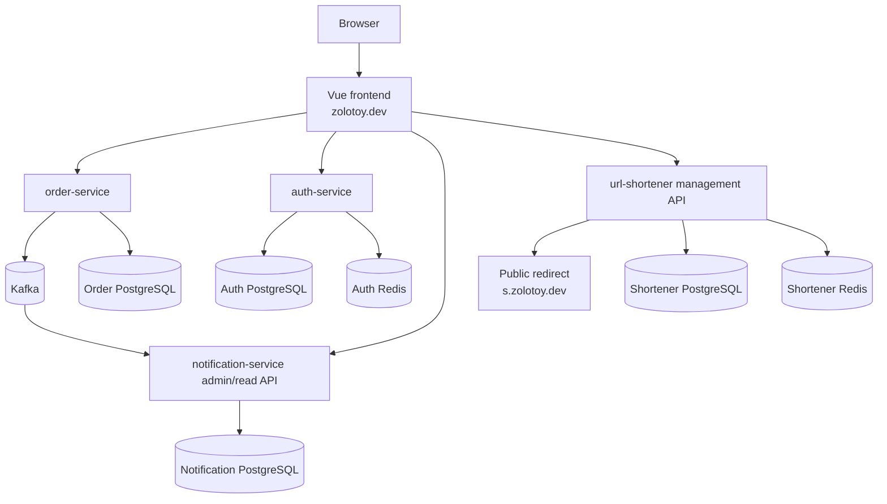

# zolotoy-dev

`zolotoy-dev` is the umbrella repository for the `zolotoy.dev` backend portfolio system.
It documents the system as a whole: repository boundaries, architecture, contract ownership,
integration order and deployment evolution. Application code does **not** live here.

## Current state

As of 2026-09-06:

- the Vue 3 frontend is implemented in [`Officialsayp/zolotoy-dev-frontend`](https://github.com/Officialsayp/zolotoy-dev-frontend);
- the frontend is deployed through Cloudflare and currently supports deterministic `mock` mode;
- the four Go backend repositories are planned but have not been created yet;
- `zolotoy-dev-infra` is being bootstrapped as the cross-service infrastructure repository;
- no `zolotoy.dev` backend production deployment is claimed yet.

See [PROJECT_STATUS.md](PROJECT_STATUS.md) for the status matrix.

## Repository family

| Repository | Responsibility | Status |
| --- | --- | --- |
| `zolotoy-dev` | System-level documentation and decisions | This repository |
| [`zolotoy-dev-frontend`](https://github.com/Officialsayp/zolotoy-dev-frontend) | Vue 3 developer/admin SPA | Implemented |
| `order-service` | Order lifecycle, payments, idempotency, concurrency, outbox | Planned |
| `auth-service` | Authentication, sessions, RBAC, token rotation, rate limiting | Planned |
| `notification-service` | Kafka consumption, durable jobs, retries, DLQ semantics | Planned |
| `url-shortener` | Redirect hot path, Redis cache, rate limiting, analytics | Planned |
| [`zolotoy-dev-infra`](https://github.com/Officialsayp/zolotoy-dev-infra) | Cross-service integration and deployment infrastructure | Bootstrap |

The backend repository names above intentionally follow the current backend specifications in
`zolotoy-dev-frontend/docs/backend-specs/`. The canonical **service names** are independent of
GitHub naming and should remain `order-service`, `auth-service`, `notification-service` and
`url-shortener`.

## System shape



This diagram is a target boundary map, not a claim that every component is already deployed.
Physical database/container topology remains an infrastructure decision; data ownership does not.

## Source-of-truth hierarchy

1. A backend service repository owns its implemented behavior, OpenAPI and migrations once it exists.
2. Until that migration happens, the service specification under
   `zolotoy-dev-frontend/docs/backend-specs/` remains the authoritative project requirement.
3. `zolotoy-dev-frontend` owns frontend architecture, UI behavior and mock/live integration behavior.
4. `zolotoy-dev-infra` owns cross-service deployment topology, edge routing, shared observability,
   backup/restore procedures and production environment inventory.
5. This repository owns system-level architecture and cross-repository decisions; it must not silently
   override a service contract.

Do not keep two files claiming to be the canonical OpenAPI or backend specification. When a service
repository is created, migrate ownership deliberately and update the links here.

## Documentation

- [Architecture](docs/architecture.md)
- [Repository boundaries](docs/repositories.md)
- [Contract ownership](docs/contract-ownership.md)
- [Integration plan](docs/integration-plan.md)
- [Roadmap](docs/roadmap.md)
- [Architecture Decision Records](docs/adr/README.md)
- [Research references](docs/references.md)

## Local verification

This repository deliberately has no application runtime and no package manager dependency.
Validate its structure and relative Markdown links with:

```bash
python scripts/check_docs.py
```

Also run:

```bash
git diff --check
```

## What does not belong here

- Go service source code;
- frontend source code;
- Dockerfiles owned by individual services;
- service database migrations;
- production secrets, tokens, private keys or real `.env` files;
- duplicated canonical OpenAPI specifications;
- deployment scripts that actually mutate infrastructure.

Those belong to their owning repositories.

## License

No license is included yet because a repository license is a project-owner decision. Add one only
when the intended reuse terms are explicitly chosen.
