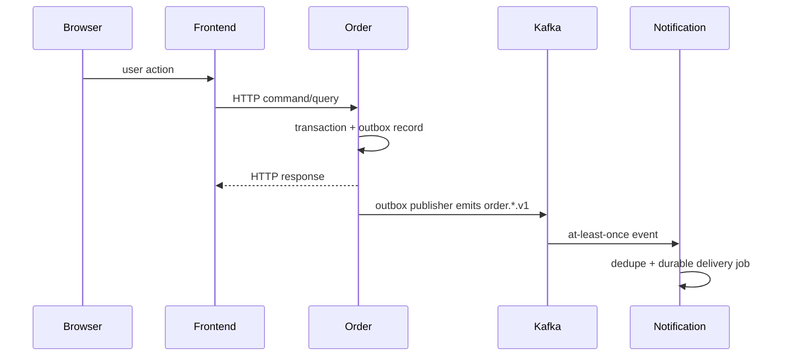

# System architecture

## Purpose

`zolotoy.dev` is a portfolio system designed to demonstrate several backend mechanics through four
independent Go services and one shared Vue developer/admin frontend. The services are separate bounded
contexts, not modules of one hidden monolith.

## Logical boundaries

| Service | Primary engineering theme | Owned state |
| --- | --- | --- |
| Order | DDD aggregate, state machines, idempotency, optimistic concurrency, transactional outbox | Orders and order history |
| Auth | Authentication/session lifecycle, refresh rotation, RBAC, security controls | Users, credentials, sessions/audit |
| Notification | At-least-once Kafka processing, deduplication, durable jobs, retries/DLQ semantics | Input-event/inbox and notification jobs/attempts |
| URL Shortener | Hot read path, cache-aside Redis, singleflight, rate limiting, asynchronous analytics | Links and redirect analytics |

No service may query another service's database directly. Integration happens through explicit HTTP
contracts or versioned events.

## Target data flow

The Order HTTP transaction must not wait for Notification delivery. Notification must treat duplicate
Kafka events as normal.

## Browser/API topology

The current frontend environment template already has separate service base URLs:

- `order-api.zolotoy.dev`
- `auth-api.zolotoy.dev`
- `notification-api.zolotoy.dev`
- `shortener-api.zolotoy.dev`
- `s.zolotoy.dev` for the public redirect path.

The first deployment plan preserves those boundaries rather than inventing a gateway rewrite before
backend contracts exist. A future `api.zolotoy.dev` gateway can be considered by ADR if it provides a
concrete benefit.

## Data ownership vs physical topology

Service data ownership is strict even if a cost-conscious single-VPS deployment later shares a
physical PostgreSQL installation. Separate databases/users and no cross-service SQL are the minimum
boundary. Whether production uses one PostgreSQL process or several containers is intentionally
left to `zolotoy-dev-infra` once resource measurements exist.

Kafka is a shared integration transport. Redis is service-owned state/cache; Auth and Shortener must
not depend on each other's keys or eviction policy.

## Observability

Each backend specification calls for structured logs plus Prometheus/OpenTelemetry-oriented
observability. Cross-service dashboards and shared collectors belong to `zolotoy-dev-infra`; service-
specific metrics/instrumentation belong to each service repository.

Do not claim tracing, dashboards or alerts exist until their configs and verified deployment exist.
